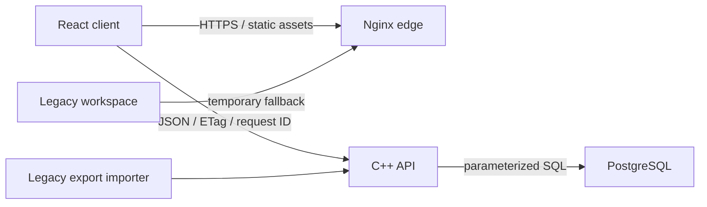

# ADR 0001: React, C++, and PostgreSQL migration

Status: Accepted

Date: 2026-07-16

## Context

getOPS began as a local-first browser application generated from one large HTML
fragment. A Python origin validated and persisted a single profile document in
SQLite. That shape proved the curriculum and interaction model, but it now makes
independent frontend, backend, and database evolution difficult:

- UI, curriculum, scoring, navigation, and state merging share one JavaScript
  module.
- The browser owns decisions that should be authoritative server behavior.
- The Python process serves both static files and persistence APIs.
- SQLite is appropriate for one local profile, but not for multiple operators,
  durable audit queries, or horizontal API workers.
- Contract changes are represented by implicit JavaScript conventions instead of
  shared schemas and typed clients.

The migration must retain existing progress, preserve revision-safe writes, and
avoid a feature freeze while the specialist simulations are ported.

## Decision

getOPS will become a client-server monorepo with these primary boundaries:

```text
apps/web/                 React and TypeScript browser client
services/api/             C++20 HTTP API and domain services
packages/contracts/       Shared TypeScript types and JSON schemas
content/                  Versioned curriculum data
db/migrations/            PostgreSQL schema migrations
infra/                    Edge and container configuration
legacy/                   Read-only migration source and fallback client
```

The production request path is:



### Frontend

- React 19 and TypeScript are the only supported implementation path for new UI.
- Vite produces immutable static assets.
- Feature folders own pages, components, hooks, tests, and local presentation
  state.
- A typed API client owns transport, timeouts, request IDs, ETags, and conflict
  handling.
- The client may calculate previews, but the API owns durable scores and evidence.

### Backend

- The API is a C++20 service built with CMake.
- `cpp-httplib` provides the loopback HTTP/1.1 server.
- `nlohmann/json` provides JSON parsing and serialization.
- PostgreSQL access uses `libpq` directly through a small RAII repository layer.
- The service owns input limits, profile IDs, state validation, optimistic
  concurrency, recall scoring, audit history, health, diagnostics, and imports.
- API handlers depend on domain services and repository interfaces, not raw SQL.

### Database

- PostgreSQL is the source of truth.
- `profile_states` stores the complete state document as `JSONB` with a monotonic
  revision and update timestamp.
- `profile_state_history` stores bounded append-only revision evidence.
- This first migration deliberately preserves the complete document. New evidence
  types can be projected into relational tables after their contracts stabilize.
- Every write locks the profile row, compares the expected revision, validates the
  candidate state, records history, and commits atomically.

### Compatibility

- The API keeps compatibility aliases for `/api/state`, `/api/export`, and the
  existing ETag format during the migration.
- A legacy JSON export can be imported into an empty PostgreSQL profile.
- The old browser client remains available under `/legacy/` until feature parity
  is explicitly measured and signed off.
- No migration step writes to the current SQLite file. Imports operate from an
  exported JSON artifact.

## State ownership

| Concern | Authoritative owner |
| --- | --- |
| Curriculum content | `content/` |
| Browser navigation and unsaved UI state | React client |
| Transport retries and ETags | typed client |
| Durable score and evidence validation | C++ domain service |
| Revision and conflict resolution | C++ repository transaction |
| Durable profile state and audit trail | PostgreSQL |
| Legacy compatibility | import adapter and `/legacy/` fallback |

## Migration sequence

1. Establish monorepo boundaries and preserve the legacy application.
2. Ship a React shell with typed API transport and health visibility.
3. Migrate Today, Learn, written recall, and operator profile.
4. Ship the C++ API and PostgreSQL state repository.
5. Add import, backup, smoke, and integration verification.
6. Port question-bank, incident, triage, shift, and interview features one domain
   at a time.
7. Remove the legacy route only after parity evidence and a rollback rehearsal.

## Consequences

### Positive

- Frontend and backend can be tested, deployed, and scaled independently.
- C++ becomes visible in a meaningful operational boundary rather than as an
  ornamental helper.
- PostgreSQL supports multiple profiles, durable history, and later analytics.
- Existing state survives because the first schema retains the full document.
- The migration can proceed feature by feature with a working fallback.

### Costs

- The repository temporarily carries two browser clients.
- Build and local-development tooling becomes more involved.
- JSONB preserves compatibility but postpones some relational modeling.
- The C++ service needs explicit memory, error, connection, and transaction
  discipline that the Python standard library previously supplied.

## Guardrails

- No raw SQL string interpolation.
- No direct browser access to PostgreSQL.
- No durable score accepted only because the client supplied it.
- No destructive import over a non-empty profile without an explicit override.
- No removal of the legacy client until automated parity checks exist.
- No generated assets, database volumes, credentials, or exports in Git.
