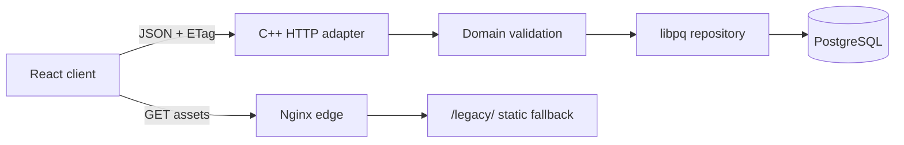

# Repository architecture

getOPS is a client-server monorepo. React is the supported browser platform,
C++ owns authoritative domain and persistence decisions, and PostgreSQL is the
durable source of truth.

```text
apps/web/
  src/app/                Routing, shell, and error boundary
  src/api/                Typed HTTP transport and ETag ownership
  src/features/           Today, Learn, Recall, Simulate, and Profile pages
  src/state/              Profile state and evidence projections

services/api/
  include/getops/         Public domain and repository interfaces
  src/                    HTTP, configuration, scoring, validation, and libpq
  tests/                  Unit and PostgreSQL integration contracts

packages/contracts/       Zod schemas and shared TypeScript types
content/                  Versioned flashcard catalog
db/migrations/            Forward-only PostgreSQL schema
deploy/                   Current runtime images and Nginx policy
legacy/                   Transitional fallback and migration source
```

## Runtime boundaries



### React client

- Owns routing, accessible interaction, drafts, filters, and display state.
- Parses every API response with shared Zod contracts.
- Serializes saves through one local queue and sends the latest revision ETag.
- May preview evidence, but does not authoritatively approve durable scores.
- Routes pressure systems to `/legacy/` until their typed migrations are done.

### C++ service

- Uses C++20, CMake, `cpp-httplib`, `nlohmann/json`, and `libpq`.
- Separates domain code, PostgreSQL repository code, and HTTP translation.
- Enforces request and profile bounds before database work.
- Recomputes rubric v2 recall attempts before state persistence.
- Converts domain, revision, and database errors into structured JSON responses.

### PostgreSQL

- Stores one JSONB state document and monotonic revision per profile.
- Retains bounded append-only revision history with request IDs.
- Serializes first writes with a profile advisory lock.
- Locks existing profile rows, compares expected revision, writes state and
  history, trims old history, and commits atomically.
- Applies forward-only migrations from `db/migrations/`.

## State ownership

| Concern | Owner |
| --- | --- |
| Curriculum source | `content/` |
| Transport schema | `packages/contracts/` |
| Browser navigation and unsaved UI | React |
| Durable scoring and evidence validation | C++ domain |
| Revision and transaction ownership | C++ repository |
| Durable profile and audit history | PostgreSQL |
| Transitional specialist features | `/legacy/` |

## Compatibility boundary

The root `server.py` and `legacy/api/` exist only for controlled fallback and
export. The current Compose stack does not run Python. The current Nginx image
serves the built legacy browser under `/legacy/`, while every `/api/*` request
goes to the C++ service.

Imports are intentionally one-way and non-destructive:

1. Read a JSON export from the legacy SQLite service.
2. Send only its state document to an empty PostgreSQL profile.
3. Let the C++ service validate the complete candidate.
4. Reload and compare canonical JSON.
5. Keep the SQLite file unchanged for rollback.

## Change discipline

1. Add new UI under `apps/web/src/features/`.
2. Add durable decisions to `services/api`, with domain tests before HTTP code.
3. Change transport fields in `packages/contracts` and OpenAPI together.
4. Add database changes as new forward-only migration files.
5. Keep generated assets, builds, volumes, exports, credentials, and backups out
   of Git.
6. Test a real legacy export against an isolated PostgreSQL profile before a
   migration release.
7. Remove `/legacy/` only after parity, backup, restore, and rollback evidence.

## Stable commands

```bash
npm run web:dev
npm run web:build
npm run api:build
npm run api:test
npm run api:test:postgres
npm run api:test:http
npm run legacy:test
npm run doctor
npm run verify:release
```

The accepted migration rationale and guardrails are recorded in
[ADR 0001](adr/0001-client-server-migration.md).
