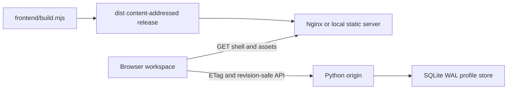

# Legacy repository architecture

This document describes the v2 local-first implementation. The accepted target
architecture and migration order are defined in
[ADR 0001](adr/0001-client-server-migration.md) and
[the migration roadmap](migration-roadmap.md).

getOPS is a local-first web application with one generated frontend release and one revision-safe Python origin.

```text
frontend/                 Editable browser application and release builder
server.py                 WSGI API, local static server, validation, and SQLite store
tests/                    Frontend, build, persistence, and backend contracts
deploy/                   Gunicorn and Nginx container definitions
scripts/                  Backup, Compose, smoke, and maintenance entry points
docs/                     Operator and contributor documentation
data/                     Runtime-only SQLite state; only .gitkeep is tracked
dist/                     Generated content-addressed release; never tracked
```

## Runtime boundaries



The browser owns curriculum presentation and deterministic exercise scoring. The origin validates bounded state shape, lineage, timestamps, score invariants, and revision ownership before persistence. Runtime database files, backups, generated assets, local environment values, and dependency caches must remain outside Git.

The typed recall subsystem is documented separately in [typed-recall.md](typed-recall.md), including scoring limits, merge rules, anti-farming behavior, and the extension checklist.

## Stable entry points

- `npm run build` produces `dist/` and the direct-open root document.
- `npm test` builds and runs frontend and release contracts.
- `python3 server.py --port 8766` starts the local origin and static server.
- `PYTHONDONTWRITEBYTECODE=1 python3 -m unittest discover -s tests -v` runs backend contracts.
- `./scripts/compose.sh up --build -d` starts the production-like loopback stack.
- `./scripts/smoke-production.sh` verifies health, immutable assets, ETags, and API cache bypass.

## Change discipline

1. Edit source under `frontend/`, never generated `dist/` files.
2. Extend browser normalization and concurrent merge behavior for every persisted field.
3. Add origin validation for any durable evidence or scored history.
4. Test a migrated real profile in an isolated database before restarting the live loopback process.
5. Back up SQLite and compare state before and after deployment.
