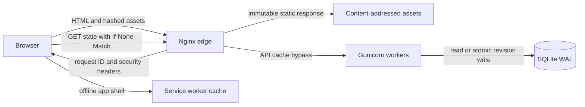
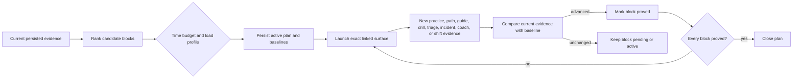
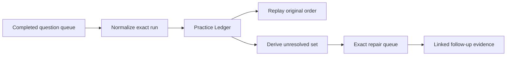
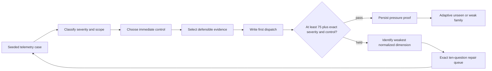
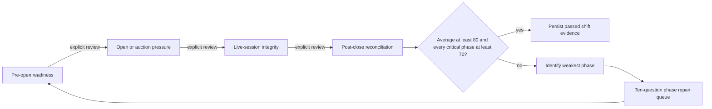
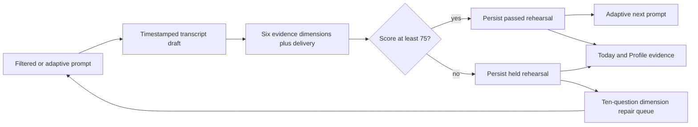
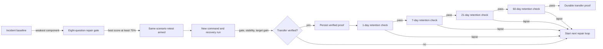

# Production Flow

## Request path



The edge is deliberately small. It serves the generated application, compresses content, applies rate and body-size limits, and proxies only `/api/*` to the origin. TLS and user access control belong at the external load balancer, private tunnel, or managed CDN in front of this stack.

## Cache policy

| Surface | Policy | Reason |
| --- | --- | --- |
| `/assets/app.<hash>.css` and `.js` | `public, max-age=31536000, immutable` | A content change creates a new URL. |
| `/`, `/index.html` | Revalidate | The shell must discover a new asset manifest quickly. |
| `/service-worker.js` and `/asset-manifest.json` | Revalidate | Prevent an old worker from pinning an old release. |
| `GET /api/state` | Private revalidation with ETag | A `304` avoids sending the state again without serving stale progress. |
| Other `/api/*` | `no-store` and edge bypass | Progress, exports, health, and diagnostics are mutable or private. |

The service worker caches only the application shell and hashed assets. It never intercepts or stores `/api/*`; when the API is unavailable, the existing browser-state fallback remains the recovery path.

## State write flow

1. The browser loads state and retains its revision ETag.
2. A save sends both the numeric revision and `If-Match`.
3. The origin starts `BEGIN IMMEDIATE`, reads the current revision, validates it, writes state plus history, and commits atomically.
4. A stale writer receives `409 Conflict` and the latest ETag.
5. The client reloads, merges monotonic progress fields, and retries once against the new revision.

## Question evidence and readiness

Question progress is retained as decision evidence, not a single permanent success flag. The browser and origin preserve bounded counters, result state, review cadence, distinct evidence dates, retention passes, confidence calibration, and misconception signals for each question.

| State | Entry rule | Operational meaning |
| --- | --- | --- |
| Unseen | No answer or skip | No decision evidence exists. |
| Repair | Latest result is a miss, reveal, elimination, or skip | The current evidence chain is broken and should be revisited. |
| Learning | One or two evidence points, or a recovered foundation | Recognition exists but has not survived enough separated recall. |
| Mastered | At least three evidence points | The item has repeated proof across separate study days. |
| Durable | Five evidence points and at least two delayed retention passes | The item has survived both repetition and scheduled delay. |

A clean decision can add at most one point per local calendar day. A wrong decision removes one point and resets the clean streak. Recovery after eliminating a wrong option can restore only foundation evidence. A same-day clean replay may rehearse the answer but cannot add evidence, award repeat XP, or advance the automatic review stage. `Again`, `Hard`, and `Good` adjust review cadence only.

Legacy state is migrated conservatively. XP, attempts, history, and dated activity remain intact, but a schema that did not record distinct evidence dates can contribute at most one provisional point. Concurrent-state merge takes the newest mastery transition rather than the numerical maximum, so a stale tab cannot restore evidence removed by a later miss.

Readiness is a 100-point sum of ten inspectable lanes rather than a completion average:

| Lane | Weight | Evidence |
| --- | ---: | --- |
| Command path | 30 | Passed prerequisite nodes, checkpoints, and pressure gates |
| Bank evidence | 20 | Mastered and durable question coverage |
| Incident pressure | 10 | Scenario pressure gates |
| Telemetry triage | 5 | Family coverage plus best severity-and-control-gated case evidence |
| Operational drills | 10 | Auto-evaluated drill passes |
| Interview transfer | 5 | Passed scored rehearsals |
| Full-shift control | 5 | Complete trading-day evidence |
| Operator guides | 5 | Completed field guides |
| Recall durability | 5 | Durable questions and stable recall cards |
| Decision quality | 5 | Accuracy discounted until the sample reaches 50 decisions |

Every readiness row carries its numerator, denominator, weighted contribution, and a direct corrective action. This keeps the score explainable and prevents a narrow high-accuracy sample from presenting as operational readiness.

## Evidence-driven shift plans

The daily Shift Plan is a bounded study-session planner, separate from the four-phase Shift Desk simulation. It snapshots the current readiness, due count, and weakest branch, then orders actionable work according to the selected load profile and fits whole blocks inside a 30, 60, 90, or 120-minute budget.



| Candidate | Completion evidence |
| --- | --- |
| Exact repair | A new 100% source-linked repair run exists. |
| Due review or adaptive queue | A new completed run of that exact mode exists. |
| Learning node | The target module is completed. |
| Path checkpoint or final mock | Its stage threshold or final mock gate is passed. |
| Guide | The target guide is completed. |
| Auto drill | The target drill reaches at least 75%. |
| Telemetry triage | A new passing run exists for the target case family. |
| Incident, interview, or full shift | A new target-specific passing run exists. |

Plan generation and synchronization never award XP. XP remains owned by the linked exercise, which prevents rebuilding or reopening a plan from becoming a reward loop. Opening a surface is not proof; each item stores its evidence baseline and closes only when the corresponding counter or gate advances.

The browser retains at most 30 plans and permits one active plan with at most one active block. Rebuilding archives the previous active plan, day rollover archives stale work, and an active block becomes skipped when its plan is archived so no in-flight state is implied. Skip and restore are explicit operator actions. A complete plan requires every block to be complete; skipped blocks keep the plan open.

Concurrent-state merge deduplicates plan and item IDs, prefers terminal item evidence over stale active state, retains only one current-day active plan, and archives competing active plans. The origin independently checks budgets, IDs, known types, text and item bounds, one-active constraints, plan-pointer integrity, terminal timestamps, and timestamp ordering before SQLite commit. Campaign exposes the latest ten plans as an audit ledger without rewriting their original evidence snapshot.

## Practice-run audit and exact repair

Finishing a question queue creates one immutable practice record before the active quiz is cleared. The browser retains the latest 100 records and identifies them by stable run ID rather than by serialized object equality.



| Record group | Persisted fields | Validation rule |
| --- | --- | --- |
| Identity | run ID, mode, origin, local date, start and completion timestamps, duration | IDs are unique; timestamps are timezone-aware and duration is recomputed. |
| Question set | ordered IDs and aligned branch IDs | At most 50 unique questions; replay order must equal its retained source. |
| Decision evidence | clean, recovered, revealed, or skipped outcome; confidence calibration | One terminal outcome and calibration per question. |
| Evidence movement | before and after mastery points | Both maps cover the exact question set with values from zero to five. |
| Selection context | bounded per-question reason | Keys may reference only questions in the run. |
| Repair lineage | derived repair IDs, replay source, repair source | Repair IDs are recomputed; a retained repair source must match the repair set exactly. |

Weighted score is recomputed as `clean + 0.5 × recovered` divided by question count. Client-supplied score, counters, repair IDs, duration, or selected-run pointers are rejected when they disagree with the underlying record. Older score-only history is migrated as explicitly `legacy`: it remains visible in trend and ledger views, but exact replay, evidence movement, and repair are disabled because question identity cannot be reconstructed honestly.

Exact replay preserves order and creates its own replay lineage record. Exact repair includes only non-clean or overconfident decisions and creates a repair lineage record. Each follow-up has exactly one direct lineage type, so a replay of a repair points to the repair run while the full ancestry remains traversable through that parent. A source run can therefore show both replay and repair descendants without rewriting its original evidence. One-question and replay runs receive normal answer XP but no full-run bonus; closing a source-linked repair can earn one bounded closure bonus, while substantive queues of five or more retain the normal score bonus.

## Telemetry triage evidence

The Triage Arena sits between isolated drills and evolving incident labs. Seven abstract case families generate deterministic dashboards from a retained 32-bit seed, so the same run can be reconstructed without storing confidential architecture, thresholds, symbols, strategies, or venue names.



| Component | Maximum | Gate semantics |
| --- | ---: | --- |
| Severity | 15 | Exact impact class earns full credit; an adjacent class earns partial credit, but cannot pass the critical gate. |
| Scope | 15 | The first confirmed unhealthy boundary earns full credit. |
| Immediate control | 30 | Only the template's safe bounded control earns full credit; full control credit is mandatory to pass. |
| Evidence | 25 | Required signals earn proportional credit and unsupported selections subtract credit. |
| Dispatch | 15 | Six bounded communication groups cover time, scope, signal, risk, control, and ownership or next update. |

An unfinished case persists its ID, template, seed, timestamps, and bounded answer draft. A completed run persists those identifiers plus component scores, selected evidence, dispatch, missing communication groups, derived critical hold, pass verdict, and weakest dimension. History is capped at 100 records. Adaptive selection prioritizes unseen families and templates that exercise the weakest dimension while suppressing the two most recent families.

XP is bounded to one completion and one pass reward per template per local day. A failed or weak run maps to one fixed ten-question band for severity, scope, control, evidence, or dispatch, and the repair queue returns to the selected triage record. Shift Plans close a triage block only after a new passing record advances the target-family baseline.

The origin validates known template identity, seed bounds, ordered timezone-aware timestamps, active-versus-complete state, expected severity and scope, mandatory control, component bounds and arithmetic, critical-hold and pass derivation, lowest normalized dimension, unique evidence indexes, text limits, history IDs, branch filters, and selected-run linkage before committing a revision. Concurrent merge deduplicates completed IDs, preserves selected evidence, prevents a completed run from returning as active, and keeps only the newest unfinished draft.

## Incident evidence records

Each completed live lab appends one bounded record to `scenarioHistory`. The record is deliberately split into command and recovery evidence so a high composite cannot hide a weak handoff or an unsupported release decision.

| Evidence group | Persisted fields | Purpose |
| --- | --- | --- |
| Identity | run ID, timestamp, scenario ID, attempt, branch | Reconstruct which decision path was exercised. |
| Command | total, decision, evidence, dispatch scores; selected evidence; missing fields; rationale; written dispatch | Explain the first control decision and communication quality. |
| Recovery | total, decision, evidence, handoff scores; selected evidence; missing fields; rationale; written handoff | Prove whether release criteria and residual risk were handled. |
| Outcome | 60/40 composite | Apply the same pressure gate used by the learning path. |

The browser retains at most 200 runs and limits each written record to 1,200 characters. The origin validates every nested score, index, branch, label, and text bound before SQLite commit. Legacy records remain valid and visible, but the UI labels missing component evidence rather than estimating it.

The repair queue is derived from the selected replay. It normalizes decision, evidence, and communication components, allocates four questions to the weakest dimension and two to each supporting dimension, then ranks candidates by scenario domain, incident relevance, unseen coverage, and prior misses. Starting the queue creates a bounded `remediationCycles` record so its baseline and question set remain reproducible without mutating the source incident.

## Full-shift evidence

Shift Desk preserves a separate operational record for an entire trading day rather than flattening four control boundaries into unrelated exercises.



Every phase persists three independent score components:

| Component | Maximum | Evidence boundary |
| --- | ---: | --- |
| Operating decision | 40 | One of four plausible controls with a phase-specific rationale. |
| Evidence selection | 30 | Correct signals earn proportional credit; unsupported pulls subtract credit. |
| Audit record | 30 | Six required time, scope, signal, risk/control, action/owner, and next-update groups. |

An active draft stores only its known template, current phase, bounded answers, completed phase results, and timestamps. It is resumable after reload and merge. A completed record must contain all four known phases, its rounded average, derived critical-hold and pass verdicts, and a weakest phase that actually has the minimum score. The browser retains at most 50 completed runs. Concurrent-tab merges deduplicate completed IDs, prevent a completed run from being resurrected as active, and keep only the newest unfinished draft.

The origin independently recomputes component totals, the rounded shift average, critical holds, pass state, and weakest-phase validity before commit. A selected shift pointer must reference retained history. This makes exported evidence inspectable while preventing client-side derived fields from being accepted on trust.

## Interview rehearsal evidence

Interview Studio treats spoken-answer preparation as bounded operational evidence rather than a transient text box.



The 24 known prompts span positioning, behavioral evidence, technical operations, and submitted-task defense at Core, Hard, and HFT levels. Every category supplies five fixed dimensions; the selected prompt adds a sixth scenario-specific anchor. Delivery contributes ten points from the prompt's target word band and sentence structure. The model answer, pressure follow-ups, and common traps remain hidden until the user explicitly evaluates the transcript.

Drafts are keyed by prompt and capped at 2,400 characters. Debounced saves write them to SQLite, and concurrent-state merge keeps the draft with the newest `updatedAt` timestamp. Completed runs preserve the prompt metadata, transcript, six dimension scores, delivery score, word count, estimated speaking time, pass state, and missing-dimension labels. History is capped at 100 unique run IDs; merge keeps the newest copy of a duplicate ID and rejects a selected-run pointer that no longer exists.

Before commit, the origin verifies the prompt's category, difficulty, branch, and target duration; exact rubric IDs and labels; minimum transcript length; word count; speaking-time estimate; delivery score; component arithmetic; the 75% pass verdict; missing labels; unique run IDs; known draft keys; filters; timer bounds; and selected-run linkage. A held rehearsal creates a reproducible question queue from its weakest dimensions and returns to the same rehearsal after practice.

## Closed-loop remediation



One open cycle is allowed per scenario. The quiz retains the cycle ID through restart and navigation; a passing score arms the retest but does not itself claim operational improvement. The next completed run for that scenario is linked as the retest and closes the cycle.

Transfer is verified only when all three controls hold:

1. The retest composite clears the 75% incident gate.
2. The composite does not regress by more than three points from baseline.
3. The targeted decision, evidence, or communication component improves by at least five points or reaches 90%.

The browser retains at most 100 cycles. The origin validates statuses, score and delta bounds, question IDs, linked run IDs, timestamps, boolean evidence, and terminal-state consistency before commit. A verified cycle earns a separate transfer-proof reward; a held cycle remains inspectable and becomes the baseline for the next repair loop.

## Transfer retention

Immediate transfer is evidence of learning, not durable recall. A verified cycle therefore creates a separate `transferReviews` record for the one-day check. Passing a check schedules the next interval at seven, twenty-one, then sixty days; passing the final interval marks that cycle durable. Only the latest verified cycle for a scenario receives a new ladder during migration, and a newer verified cycle supersedes still-open checks for the older baseline.

Each check is an immutable audit step with a controlled state transition:

| State | Meaning | Allowed next state |
| --- | --- | --- |
| `scheduled` | Due date and reference floors are fixed. | `armed`, `superseded` |
| `armed` | The linked scenario is active without prior answers. | `passed`, `failed`, `superseded` |
| `passed` | Composite and target floors both held. | Terminal; schedule the next stage. |
| `failed` | At least one retained-control floor failed. | Terminal; derive a new repair cycle from the failed run. |
| `superseded` | A newer verified baseline replaced this open check. | Terminal. |

The composite floor is the reference score minus five points, bounded between 75% and 90%. The targeted decision, evidence, or communication floor is the reference component minus five points, bounded between 70% and 85%. Legacy runs without component evidence use a five-point composite-regression proxy. This keeps high-quality proofs meaningfully demanding while avoiding an impossible requirement to repeat a perfect score.

The browser retains at most 200 checks and permits one armed check at a time. The origin validates stage and interval pairing, `YYYY-MM-DD` due dates, score and delta bounds, terminal run links, cycle references, boolean verdicts, and the active-review pointer before committing a revision. Concurrent-tab merges prefer terminal evidence over stale scheduled or armed state.

## Run

```bash
cd "/Users/afreitas/Documents/Quant Trader interview prep/trading-ops-ascent"
cp .env.example .env
./scripts/compose.sh up --build -d
./scripts/smoke-production.sh
```

The safe default binds the edge to `127.0.0.1:8766`. Put TLS and authentication in front before changing `OPS_BIND` to `0.0.0.0` on an internet-reachable host.

## Operations

Before changing the live process, run the isolated release gate:

```bash
npm run verify:release
```

The gate builds the release, runs frontend and backend contracts, starts the
origin on an ephemeral loopback port with a temporary SQLite database, checks
static caching and ETag behavior, saves valid flashcard evidence, rejects a
forged rubric score, verifies export and database integrity, and removes all
temporary state on exit.

```bash
./scripts/compose.sh ps
./scripts/compose.sh logs -f origin edge
./scripts/backup.sh
./scripts/compose.sh down
```

Origin logs are one JSON record per request with request ID, status, bytes, and duration. Nginx rotates container logs through the Docker logging configuration. Backups use SQLite's online backup API and run an integrity check before replacing the destination file.
